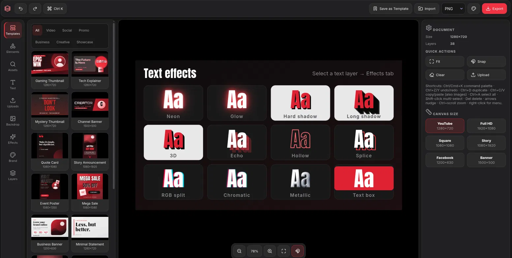
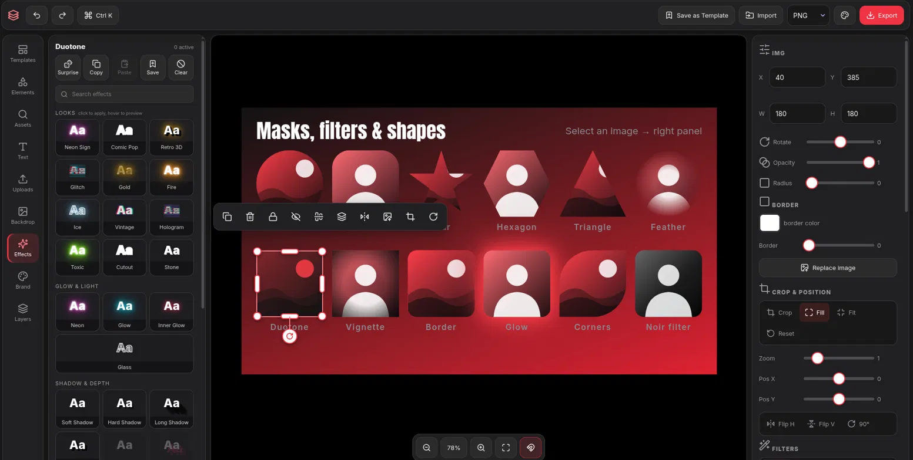
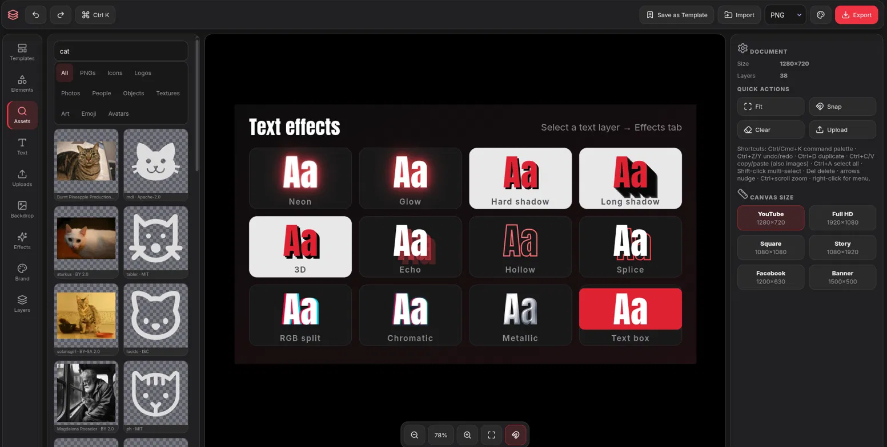

# Wishwa

**A free, flexible, browser-based design editor.**  
Plain HTML, CSS and JavaScript. No account, no backend, no build step. Templates, text effects, image tools and layers, then export.


**Live demo:** https://wishissue.github.io/wishva/



---

## Why Wishwa?

I wanted a Canva-style tool that is free, quick to open and easy to bend to my own needs, without sign-ups, paywalls or watermarks. So I built one.

- **Free and account-free.** Open the page and start designing.
- **Runs in your browser.** Your project lives on your device, and exports are rendered locally.
- **Three small source files.** Markup, styles and logic are split into `html.html`, `css.css` and `java.js`, tied together by `index.html`. Fork it, read it, change it.

---

## Features

### Design tools

| Feature | Details |
| --- | --- |
| **Templates** | 14 built-in starters (thumbnails, banners, social posts, posters, promos, two showcase guides) plus your own saved templates |
| **Shapes** | Rectangle, rounded, circle, glass, line, triangle, star, hexagon, arrow |
| **Text** | 12 Google Fonts plus Georgia and Courier New, weight, spacing, line height, alignment, italic, curved text |
| **Fills** | Solid colors, multi-stop gradients, stroke and border |
| **Canvas sizes** | YouTube, Full HD, Square, Story, Facebook, Banner |

### Images

- **Upload** by button, drag and drop, or paste (`Ctrl+V`).
- **Crop and position:** crop mode, zoom, pan, fill or fit, flip, rotate 90°, replace image.
- **Filters:** presets (Vivid, Noir, Cyber, and more) plus brightness, contrast, saturation, hue, blur, grayscale, sepia and invert.
- **Masks and styling:** circle, rounded, star, hexagon and triangle masks, per-corner radius, duotone, vignette, feathered edges.
- **Pixelate and halftone**, baked into the image and undoable.

### Effects studio



Stackable text and shape effects: neon, glow, inner glow, soft, hard and long shadows, 3D, outline, sticker, glass, metallic, grain, scanlines, RGB split, chromatic, distortion, emboss, hollow, echo, lift, text box and splice.

- Hover to preview, then apply or revert.
- Built-in looks, plus save your own.
- Copy and paste effect stacks, randomize, and adjust overall strength.

### Workflow

- **Layers panel:** rename, reorder by dragging, hide, lock, delete.
- **Selection:** multi-select with Shift-click or `Ctrl+A`, grouping, alignment and distribution.
- **Smart guides:** snapping with spacing readouts.
- **Command palette** (`Ctrl/Cmd+K`) with live effect previews and quick commands like `rotate 15` or `opacity 60`.
- **Undo and redo**, right-click menu, a floating toolbar for the selected layer.
- **Brand kit:** saved colors, gradients, favorite fonts and logos.
- **Asset search:** icons, logos, emoji, photos, textures, art and avatars, each with a credit and link to its source.



- **Three color themes:** Black, Charcoal and Deep crimson.

### Export

PNG, JPG, WebP, PDF (single page, image-based) or project JSON. Import a JSON file to continue a project.

---

## Project structure

```
design-editor/
├── index.html      Master file: head/meta, loads css.css, pulls in html.html, then starts java.js
├── html.html       The editor's markup (toolbar, panels, canvas containers)
├── css.css         All styles
├── java.js         All editor logic (canvas, effects, layers, export, storage)
├── screenshots/    Images used in this README
├── LICENSE
├── .gitignore
└── .nojekyll       Tells GitHub Pages to serve files as-is
```

Keep all four of `index.html`, `html.html`, `css.css` and `java.js` in the same folder.

---

## Using it

| Do this | To get this |
| --- | --- |
| Pick a card in **Templates** | Load a starter design (this replaces the current canvas) |
| Add from **Elements**, **Text** or **Uploads** | New shapes, text and images |
| Click an object | Edit it in the right panel, drag the handles to resize or rotate |
| **Effects** tab | Style the selected layer, hover to preview, press Apply |
| **Layers** tab | Reorder, rename, hide or lock |
| **Brand** tab | Reuse saved colors, gradients, fonts and logos |
| Choose a format, click **Export** | Download the finished design |

**Keyboard shortcuts:** `Ctrl+K` command palette · `Ctrl+Z` / `Ctrl+Y` undo and redo · `Ctrl+D` duplicate · `Ctrl+C` / `Ctrl+V` copy and paste (images too) · `Ctrl+A` select all · `Ctrl+G` group · `Ctrl+Shift+G` ungroup · `Shift`-click multi-select · `Del` delete · arrows nudge (`Shift` = 10px) · `Ctrl+scroll` zoom · `Esc` close or cancel

> **Tip:** Press `Ctrl+K` and start typing. Almost everything in Wishwa is in the palette.

---

## Getting started

### Use it online

Open the live demo above. Nothing to install.

### Run it locally

```bash
git clone https://github.com/wishissue/design-editor.git
cd design-editor
python3 -m http.server 8000
```

Then open http://localhost:8000.

> **Note:** `index.html` loads `html.html` with `fetch()`, which browsers block on `file://` URLs. Double-clicking `index.html` therefore shows a short help message instead of the editor. Use any static server (`python3 -m http.server`, `npx serve`, VS Code Live Server) or GitHub Pages.

An internet connection is needed for fonts, icons and asset search. Wishwa itself loads without it, but fonts will fall back to system fonts.

### Deploy your own copy (GitHub Pages)

1. Fork or push this repo to your GitHub account.
2. Go to **Settings → Pages**.
3. Set **Source** to *Deploy from a branch*, branch `main`, folder `/ (root)`.
4. Save. The site goes live at `https://YOUR_USERNAME.github.io/design-editor/`.

No Actions, build step or custom domain needed.

---

## What's stored, and what isn't

Everything is kept in your browser's `localStorage`, on your device only:

- Autosave of your last session
- Saved templates
- Brand kit (colors, gradients, fonts, logos)
- Saved effect looks
- Theme and recent commands

There is no server and no account. **Clearing site data deletes all of it**, so export a project as JSON to keep a backup. Very large projects can exceed browser storage; Wishwa warns you when autosave pauses.

---

## Credits, licenses and attribution

Wishwa's own code is MIT licensed. It loads the following from the web:

| Resource | Used for | License |
| --- | --- | --- |
| [Lucide](https://lucide.dev) | Interface icons | ISC |
| [Google Fonts](https://fonts.google.com) | Inter, Bebas Neue, Anton, Pacifico, Montserrat, Oswald, Bangers, Permanent Marker, Orbitron, Playfair Display, Lobster, Righteous | SIL Open Font License |
| [Iconify](https://iconify.design) | Icon, logo and emoji search | Depends on the icon set |
| [Openverse](https://openverse.org) | Photo and art search | CC0, public domain, CC BY, CC BY-SA |
| [Wikimedia Commons](https://commons.wikimedia.org) | Photo fallback | Varies per file |
| [DiceBear](https://www.dicebear.com) | Avatars | Varies per style, check each style's page |
| [wsrv.nl](https://wsrv.nl) | Image proxy fallback | Third-party service |

### Please read before publishing a design

- **CC BY and CC BY-SA images need attribution.** Photos and art from Openverse and Wikimedia may require you to credit the author wherever you publish your design. Wishwa shows the credit and source link when you select the image, but it is **not printed on the exported image**. Crediting is your responsibility.
- **Logos can be trademarks.** A logo file may be freely licensed while the brand behind it is still a registered trademark. Using someone's logo in your design does not give you the right to imply endorsement or affiliation.
- **Twemoji is CC BY 4.0** and requires attribution.
- **Check each asset's license** before commercial use. Being searchable here does not make an asset free for every purpose.
- **Privacy note:** searching assets sends your search terms, and sometimes image URLs, to the third-party services listed above.

---

## License

The code is released under the [MIT License](LICENSE). Third-party assets keep their own licenses, as described above.

## Contributing

Issues and pull requests are welcome. Please open an issue first for larger changes, and try to keep the project dependency-free (plain HTML, CSS and JS, no build step).

---

Made for making things.
